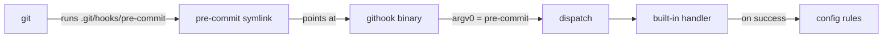

# githook

A single multi-call binary that manages git hooks, busybox-style. When invoked
through a symlink named after a git hook, it runs that hook; when invoked as
`githook`, it exposes a management CLI.

## How it works

`githook install` creates one symlink for each of the 17 supported git hooks in
the target hooks directory. Every symlink points back at the `githook` binary.
When git fires a hook, it executes the symlink, and `githook` detects which hook
to run from the name it was invoked as (`os.Args[0]`) — the same mechanism
busybox uses to embed many commands in one binary.



### Execution order

For each hook, `githook` runs:

1. The compiled-in built-in handler for that hook.
2. If the built-in succeeds, every rule defined for that hook in the repository
   config, in order.

Any non-zero result aborts the hook (and therefore the git operation), unless a
rule opts out with `allow_failure`.

## Supported hooks

17 git hooks are managed:

| Client-side | Server-side |
| --- | --- |
| `applypatch-msg`, `pre-applypatch`, `post-applypatch` | `pre-receive` |
| `pre-commit`, `pre-merge-commit`, `prepare-commit-msg` | `update` |
| `commit-msg`, `post-commit`, `pre-rebase` | `post-receive` |
| `post-checkout`, `post-merge`, `pre-push`, `sendemail-validate` | `post-update` |

Only hooks whose contract is "run and check the exit status" are managed. Hooks
that git invokes with a special protocol or that override git's own behaviour are
deliberately excluded, because a no-op symlink to this binary would break them:
`push-to-checkout` (replaces the built-in checkout), `proc-receive` (pkt-line
protocol), and `fsmonitor-watchman` (emits the changed file list on stdout).

## Built-in handlers

Hooks without a compiled-in handler do nothing by default and act purely as a
host for config rules. The following hooks ship with built-in behaviour:

### commit-msg

Enforces a single-line conventional-commit policy. The message must:

- follow `<type>: <subject>` or `<type>(<scope>): <subject>`;
- use an allowed type: `feat`, `fix`, `perf`, `deps`, `revert`, `docs`, `chore`;
- carry no breaking-change `!` marker;
- contain only a subject line (no body, no multi-line content);
- be at most 72 characters for the whole header;
- have a non-empty subject with no trailing period.

### pre-commit

Runs `yake run` (the project's tests and policy checks) before a commit. When
`yake` is not found on `PATH` the hook is skipped so commits are not blocked in
environments without it; when present, a failing run aborts the commit.

The check is bypassed entirely when the file `skip-pre-commit` exists in the git
directory:

```bash
touch .git/skip-pre-commit    # disable the pre-commit check
rm .git/skip-pre-commit       # re-enable it
```

## Commands

| Command | Description |
| --- | --- |
| `githook install` | Create symlinks for all hooks; existing entries are overwritten. |
| `githook uninstall` | Remove only githook-managed symlinks; foreign hook files are left in place. |
| `githook list` (alias `status`) | Report each hook as `managed`, `foreign`, or `missing`. |

### Install target

By default, commands operate on the current repository's hooks directory
(honouring an existing `core.hooksPath`). Pass `--global` to operate on a shared
directory (`~/.config/githook/hooks`) and configure git's global
`core.hooksPath` to point at it, applying the hooks to every repository.

```bash
githook install            # current repository
githook install --global   # all repositories
```

## Configuration

Hook behaviour is extended with an optional `.githook.yaml` (or `.githook.yml`)
file in the repository root. It maps hook names to a list of rules; each rule
runs a command through `/bin/sh` after the built-in handler succeeds.

```yaml
hooks:
  pre-commit:
    - name: lint
      run: golangci-lint run
    - name: unit tests
      run: go test ./...
      allow_failure: false
  commit-msg:
    - name: conventional commit
      run: 'grep -qE "^(feat|fix|chore|docs)(\(.+\))?: " "$1"'
```

A rule has three fields:

| Field | Description |
| --- | --- |
| `name` | Optional label shown in output. |
| `run` | Command executed through the shell. |
| `allow_failure` | When `true`, a non-zero exit is reported but does not abort the hook. |

The hook's arguments are passed to each rule as positional parameters
(`$1`, `$2`, …), matching how git invokes the hook. For example, `commit-msg`
receives the path to the commit message file as `$1`.

When no config file is present, only the built-in handlers run.
